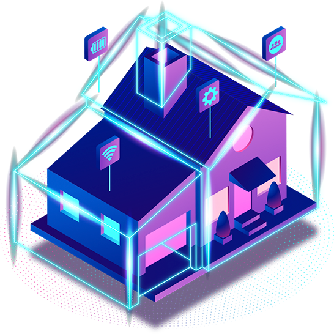
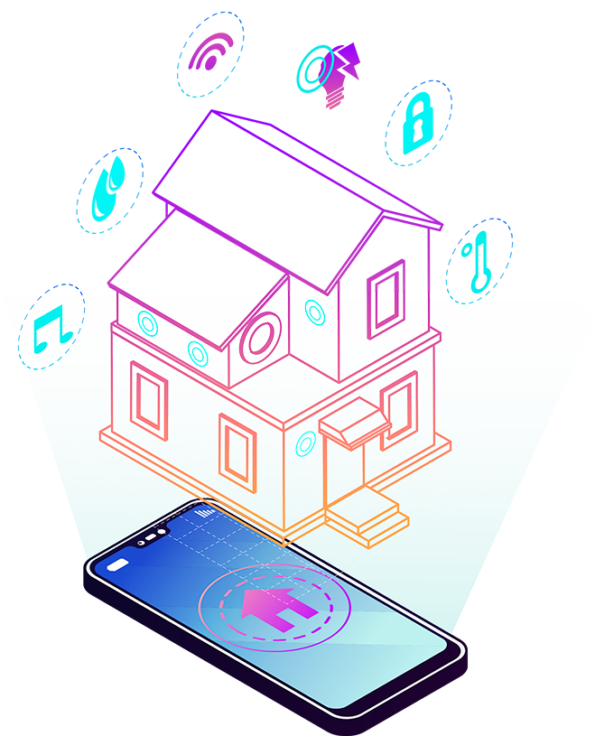

<!DOCTYPE html>
<head>
    <title>SMART HOME</title>
    <link rel="stylesheet" href="smart.css" media="screen">
</head>

<body>

    <header>

        

            

            

                <ul>
                    <li><a>Home</a></li>
                    <li><a>About</a></li>
                    <li><a>Accesss Control</a></li>
                    <li><a>Digital</a></li>
                </ul>
            

            <form>
                <input type="search" name="p" placeholder="Search">
            </form>

            

                
                
                
                
            

        

    </header>

    <section>
        

            

                <h1>FUTURE  IS NOW</h1>
                
Тут был текст, предположительно на латыни, 
                    кoторый я не могу опознать. Наверное должно быть,что-то 
                    мотивируещее и про будущее, типо: 
                    Будущее будет и будет оно капец каким инновационным и ваще чики-пуки

                <button>See More</button>
            

            

                
            

        

    </section>
    <section>
        

            

            

              <h2>SMART HOME</h2>
                <h3>Security System</h3>

                

                    тут описаны наши волшебные технологии,и по вашему лицу текут слёзы от осознания того,на сколько это прекрастно.
                

            

        

    </section>
    <section>
        

            
            

                <h2>ADVANTAGES</h2> 
                <ol>
                    <li>Удобство</li>
                    <li>Безопасность</li>
                    <li>Экономия энергии</li>
                   <li>Управление с любого места</li>
                   <li>Интеграция с другими устройствами</li>
                </ol>
            

        

    </section>
    <section>
        

            
        

        

        

                <h1>PROGRAMMER</h1>
                
Великий программист и создатель сайта

            

            

                
            

        

    </section>
    <footer>
        

            

              
              
              
              
            

            
Copyright © 2026 Smart Home. All rights reserved.

        

    </footer>
</body>
</html>
</body>
